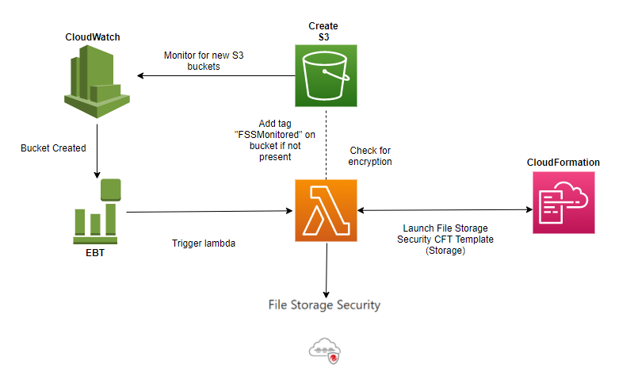

# Automation using Lambda to Deploy FSS- Storage Stack 

Automated process to deploy FSS Storage stack on each new S3 bucket using Lambda. The storage stack will be linked to the scanner stack previously defined.

# Create IAM Role/Policy for lambda execution
   * In AWS Console > Services > IAM
    - In left panel under **Access Management** click **Policy**
    - Click **Create Policy**
        - Select **JSON**
        - paste **[fss_policy](https://github.com/JustinDPerkins/FSS-Storage-Automation-Lambda/blob/main/policy/fss_policy.json)**
        - **Save**
  * In AWS Console > Services > IAM
    - In left panel under **Access Management** click **Roles**
    - Create Role
        - Entity: **AWS Service**
        - Service: **Lambda**
        - select policy made previously
        - **Save**

# Create Lambda Function
   * In AWS Console > Services > Lambda >  Create Function
      - Select **Author from scratch**
      - Function Name: *example-name*
      - Runtime: **Python 3.8**
      - Select Service role: **Select role created in previous steps**
      - Create Function
   * Under Code
      - Copy and Paste: **[storage_stack_fx.py](https://github.com/JustinDPerkins/FSS-Storage-Automation-Lambda/blob/main/lambda/storage_stack_fx.py)**
      - Deploy
   * Under Configuration
      - Environment Variables
        - **C1-API** : *your fss api key*
        - **SQS_Name** : *scanner sqs url*
        - **STACK_ID** : *scanner stack id*
      - See [FSS API Documentation](https://cloudone.trendmicro.com/docs/file-storage-security/api-create-stack/) for details.
      - Configuration
        - General configuration > Edit
        - increase timeout to 8m

# Create CloudWatch Rule
   * In AWS Console > Services > CloudWatch
      - In left panel under **Events** click **Rules**
   * Create New CloudWatch Rule
      - Event Source: Event Pattern
      - Service Name: S3
      - Event Type: Bucket Level Operations
      - Specific Operation(s): CreateBucket
   * Add Target
      - Select: **Lambda Function**
      - Choose the function made in  first step
      - leave the rest to defaults
   * Configure Rule details
      - Name: *example-rule-name*
      - Description: 
      - State: **Enabled**
      - Create rule 
 
