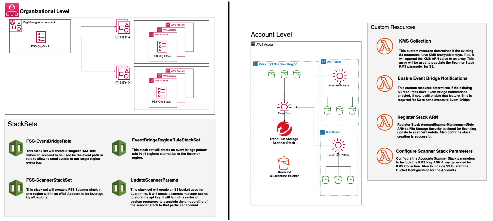

# File Storage Security Organizational Deployment Options

This repo contains templates to deploy Trend Cloud One File Storage Security throughout an AWS Organization.

## Deploy a single Central Scanner to each AWS Account [Cross-Region Scanning]

### What is going on?
- The Main Template is deployed to Master Admin Account for an AWS Organization.
- The template will create a series of StackSets that will deploy StackInstances to all Accounts within the provided OU-ID's.
- The First StackSet will create an IAM Role in each account to be used by EventBridge to send events.
- The Second StackSet will create the EventBridge Rule Pattern in every AWS Region you determine to monitor in.
- The Third StackSet deploys the File Storage Scanner Stack to a Main AWS Region defined.
- The Fourth StackSet deploys various resources to perform the following tasks:
   - Creates an S3 Bucket in the same region as the Scanner Stack for Quarantine in that account.
   - Creates a Secret in Secrets Manager for the API Key secure storage.
   - Determines any KMS Key ARN's associated with applicable existing S3 resources in that account.
   - Enables EventBridge Notifications for all existing S3 resources in that account.
   - Registers the File Storage Scanner Stack to Trend Backend for Licensing Updates.
   - Updates Scanner Stack Parameters to include quarantine and KMS Keys.

---

## What is needed before you deploy

You will need:
   - AWS Account
   - Valid Cloud One Account
   - Full Access Cloud One API Key.

---

### Deployment Steps

- DeployScannerTo: Home Region for Scanner to be deployed in
- RegionsToEnable: Alternative region to where the Scanner was deployed. This will allow for events outside the scanner region to be routed to the Scanner Stack.
- OrgOUID: Comma Separated list of Organization Unit ID values to target the accounts in for deployment.
- APIKey: Cloud One FA API Key Value.

--- 

#### Needs to be developed

- Tag the buckets that are being Scanned
- Automate for new buckets being created
- Scann all existing objects in S3