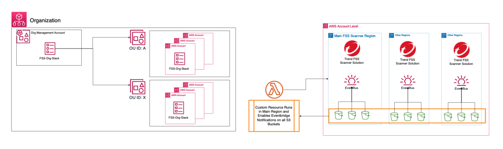
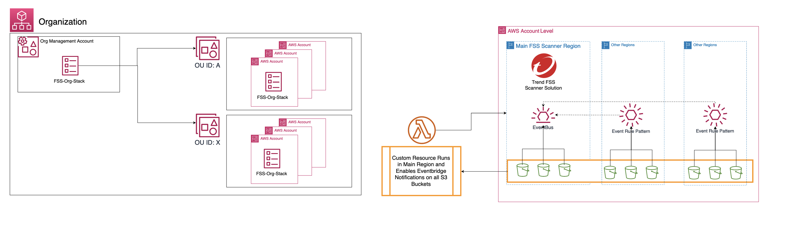

# File Storage Security Organizational Deployment Options

This repo contains template options to deploy Trend Cloud One - File Storage Security throught an AWS Organization.

## Deploy a Scanner to every AWS Region.

### How it works
- Main Template is deployed to Master Admin Account for an AWS Organization.
- The template will create a two StackSets that will deploy StackInstances to all Accounts within the provided OU-ID's.
- The First StackSet deploys the File Storage Scanner Stack to every AWS Region desired.
- The Second StackSet deploys a Custom Resource to enable all existing S3 buckets to use EventBridge Notifications.

---

## Deploy a single Central Scanner to each AWS Account.[Cross-Region Scanning]

### How it works
- Main Template is deployed to Master Admin Account for an AWS Organization.
- The template will create a series of StackSets that will deploy StackInstances to all Accounts within the provided OU-ID's.
- The First StackSet will create an IAM Role in each account to be used be eventbridge to send events.
- The Second StackSet will create the EventBridge Rule Pattern in every AWS Region you determine to monitor in.
- The Third StackSet deploys the File Storage Scanner Stack to a Main AWS Region for Central Scanning.
- The Fourth StackSet deploys a Custom Resource to enable all existing S3 buckets to use EventBridge Notifications.

Please Note: Cross region Scanning can increase AWS Costs.

---

## What is needed before you deploy

You will need:
   - AWS Account
   - Valid Cloud One Account

--- 
Needs to be developed

- Tag the buckets that are being Scanned
- Automate for new buckets being created